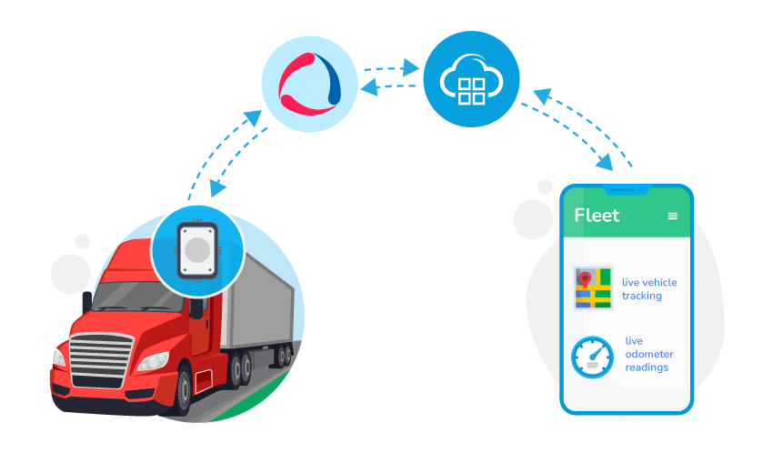
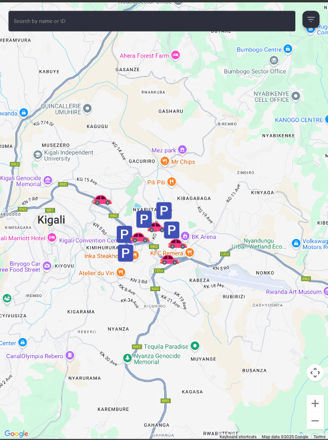
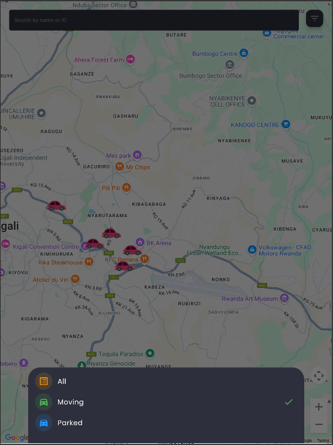
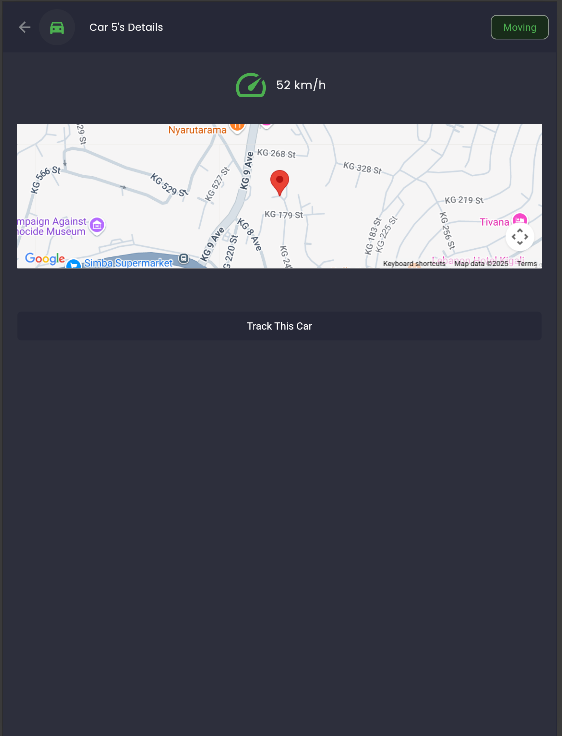
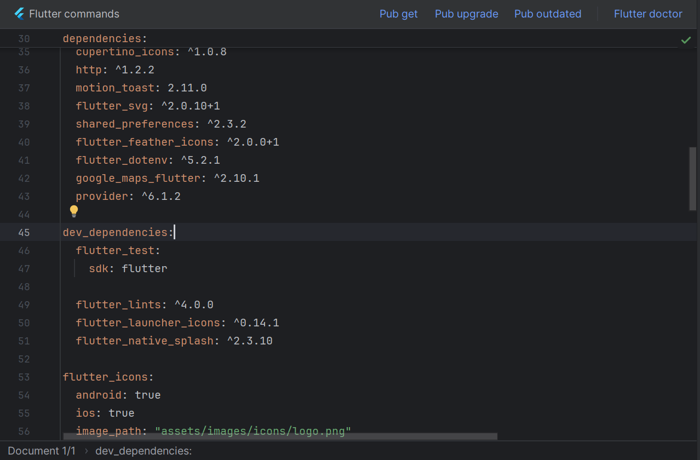
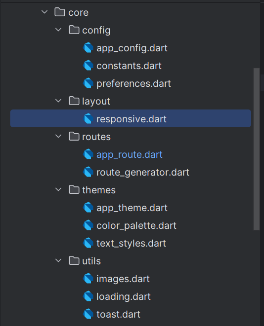
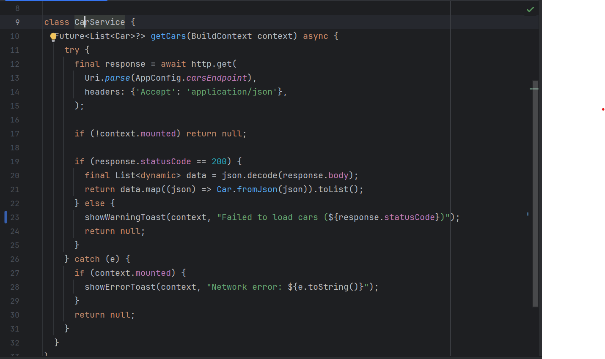
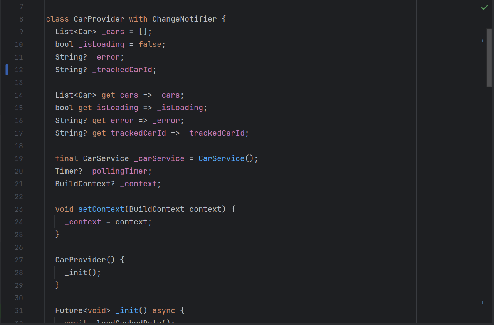
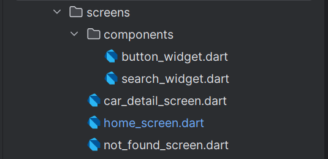

# 🚘 Fleet Monitoring App – Flutter + Google Maps

A mobile and web application to **track live car locations** in Kigali with Google Maps, status filters, and car details.  
Built in Flutter using real-time polling, state management (Provider for this case ), and REST APIs.

  

---

## 🌐 Live Demo

👉 Try it on the web: [fleet-monitoring.vercel.app](https://fleet-monitoring.vercel.app)

---

## 📱 Key Features

| Feature                                        | Screenshot |
|------------------------------------------------|------------|
| **Real-time Google Map** – See all cars on map |  |
| **Search & Filter** – Parked / Moving          |  |
| **Vehicle Details** – Speed, location, status  |  |
| **Pull-to-Refresh** – With auto-polling        |  |

---

## 🧠 How It Works

- **Frontend** built in **Flutter**
- **Backend API**: mock API (or live) returning car objects with geolocation
- **Location polling** every 5 seconds
- **State management** via Provider
- **Responsive UI** for Android, iOS & Web

---

## 🛠 Tech Stack

| Purpose | Package |
|--------|----------|
| Google Maps | `google_maps_flutter` |
| State Management | `provider` |
| Local Storage | `shared_preferences` |
| Toasts & Alerts | `motion_toast` |
| Splash Screen | `flutter_native_splash` |
| Launcher Icon | `flutter_launcher_icons` |

📦 Screenshot of `pubspec.yaml`:

---

## 🗂 Project Structure

| Folder | Screenshot |
|--------|------------|
| `lib/core/` – constants, helpers |  |
| `lib/models/` – data classes |  |
| `lib/services/` – API & local storage |  |
| `lib/providers/` – app state |  |
| `lib/screens/` – UI views |  |

---

## 🔐 Environment Configuration

Sensitive data like API keys are stored in a `.env` file (for Android) and injected into:

- `android/local.properties`
- `ios/Runner/Info.plist` (visible for ios in this case)
- `web/index.html` (visible in frontend)

📷 Example `.env` config:

